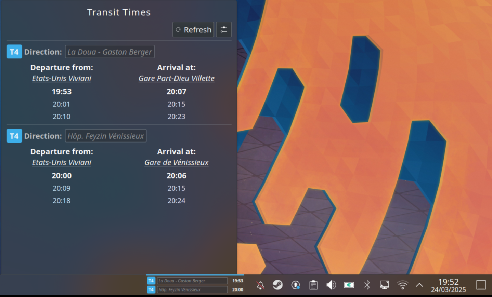

# KDE Widget

## Install / Update

1. Run `install.sh`
2. Log-out from KDE and log-in again
3. Configure server and credentials using the widget's builtin configuration pane

## Testing

1. Update config in `package/contents/config/main.xml` (Don't commit)
2. `plasmoidviewer -a ./package/` to preview the full representation
3. `plasmoidviewer -f horizontal -a ./package/` to preview the compact representation

## Disclaimer

Written 95% by AI.
